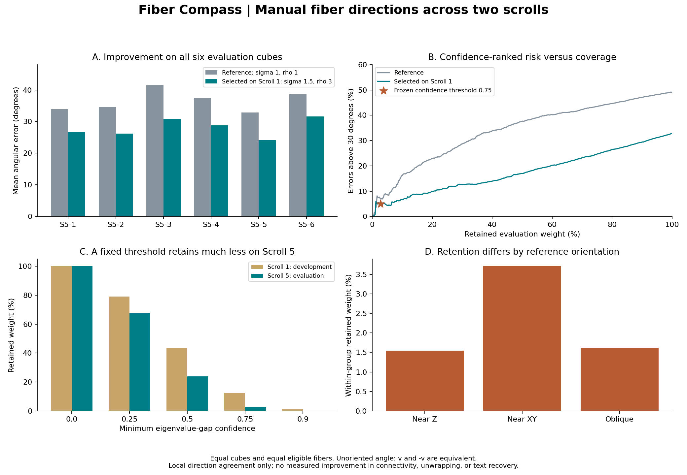
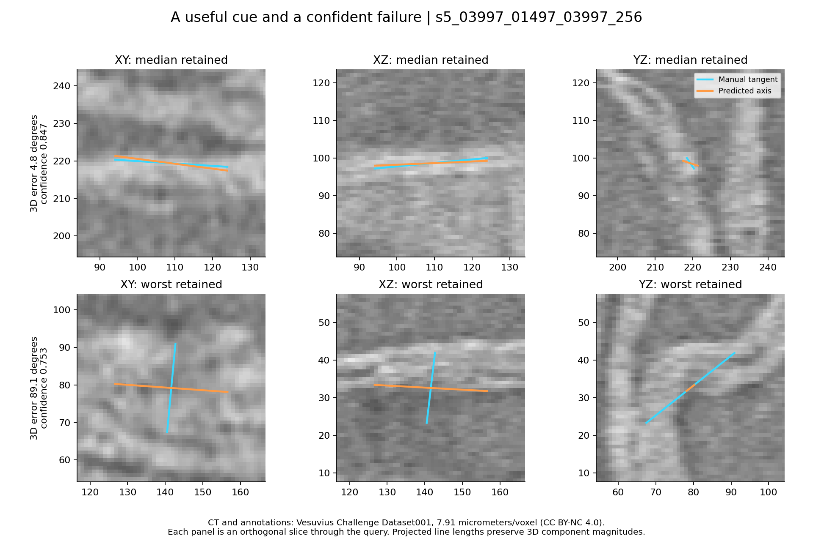

# Fiber Compass

**A reproducible test of local fiber directions against manual papyrus traces, with confidence/coverage diagnostics and a CPU Zarr exporter.**

The Vesuvius Challenge's [fiber connectivity problem](https://scrollprize.org/2026_open_problems#fibers-as-connectivity-clues) needs reliable geometric cues. This tool measures direction agreement at annotated fiber locations before those cues are trusted in a tracer or surface fitter.

It evaluates all 11 CT/NML pairs in [Dataset001_sk-fibers-20250124](https://dl.ash2txt.org/datasets/fiber-skeletons/Dataset001_sk-fibers-20250124/). Five Scroll 1 cubes select parameters and a confidence threshold; six Scroll 5 cubes are evaluated after the selection is frozen. No model weights, training service, GPU, or paid API is needed.

## What the real-data experiment found

| Scroll 5 evaluation | Mean angle | Errors above 30° | Retained weight |
|---|---:|---:|---:|
| Gaussian structure tensor, sigma=1 / rho=1 | 36.50° | 49.10% | 100% |
| Parameters selected on Scroll 1, sigma=1.5 / rho=3 | **28.06°** | **32.81%** | 100% |
| Selected parameters, frozen confidence >=0.75 | 9.82° | 5.06% | **2.74%** |

The selected scales improve mean error on **all six evaluation cubes**: an 8.45° absolute / 23.1% relative reduction against the stated Gaussian baseline. This is not a comparison with the current Lasagna neural tracer or a state-of-the-art claim. On the same retained subset, the reference is 14.67° versus the selected method's 9.82°; filtering alone is not the whole improvement.

**The coverage result is a material limitation.** The frozen threshold retains 12.42% of development weight but only 2.74% on Scroll 5. One evaluation cube still has 14.45% errors above 30° among retained points. A cube/fiber cluster bootstrap gives a wide 0.70–14.74% interval for aggregate retained error frequency. The threshold does **not** establish a universal 10% error guarantee, and its score is not a probability.



The benchmark exposes confident orthogonal failures, not just average accuracy. Below are the median-error retained point and the worst retained point in the first evaluation cube, selected deterministically:



There is no demonstrated improvement in long-range connectivity, sheet reconstruction, or text recovery. These are local direction measurements against approximate human traces. The practical result is a reusable evaluation/triage instrument, an improved classical baseline on this dataset, and evidence that confidence thresholds need cross-scroll validation.

## Reproduce

Python 3.11+; about 532 MiB of downloads. The experiment used Python 3.13.5, NumPy 2.5.3 and SciPy 1.16.2 on Windows. Evaluation of all six Scroll 5 cubes took about 190 seconds on the local CPU; runtime varies. Allow several GiB of RAM for the largest 512³ reference computation. The tiled exporter uses smaller processing blocks.

```bash
python -m venv .venv
# Activate .venv for your shell, then:
python -m pip install -r requirements.txt
python download_data.py
python -m pytest -q
python run_benchmark.py develop
python run_benchmark.py evaluate
python make_report.py
```

The repository includes the original results. To rerun development, first move the included `results/` directory aside (for example, rename it `published_results/`). The runner intentionally refuses to retune when an evaluation file already exists. `download_data.py` creates a new results directory and records SHA-256 hashes; these are locally measured fingerprints, not checksums signed by the dataset host.

[protocol.json](protocol.json) fixes the data split, seven parameter candidates, metric and thresholds. [selection.json](results/selection.json) records the chosen scales, threshold, timestamp and method/protocol hashes. [develop.json](results/develop.json), [evaluate.json](results/evaluate.json), [per_cube.csv](results/per_cube.csv), and [analysis.json](results/analysis.json) contain the results, exclusions and uncertainty calculation. `cache/` and `data/` are not committed.

## Evaluate another method

After reproduction, each `cache/CASE/samples.npz` contains local ZYX query positions, reference tangents, fiber IDs and weights. Query your model at those positions and write an NPZ with:

- `positions_zyx`: N×3, exactly the same query positions/order.
- `axes_zyx`: N×3 directions; either sign is accepted.
- `confidence`: N values in [0,1], with larger values meaning more confident.

```bash
python evaluate_predictions.py cache/CASE/samples.npz predictions.npz --output score.json
```

Missing/invalid directions count as 90° in the all-sample score and as abstentions in thresholded scores. Coordinate mismatches fail explicitly. The report ranks fibers for review and counts confident failures. Published per-fiber reports are in [results/triage](results/triage). Fiber indices identify valid graph paths, not necessarily NML thing IDs.

## Export and use a direction field

The exporter accepts 3D uint8 TIFFs in ZYX order. It produces ordinary **Zarr v2**, not an OME-NGFF-compliant multiscale image. It stores six components of the sign-invariant axis projector `v vᵀ`, confidence and eigenvalues, plus source hash, origin, stride, voxel size and axis metadata.

```bash
python export_field.py data/imagesTr/s5_03997_01497_03997_256_0000.tif cache/demo.zarr --origin-xyz 3997 1497 3997 --voxel-micrometers 7.91
python sample_field.py cache/demo.zarr cache/s5_03997_01497_03997_256/samples.npz cache/demo_predictions.npz --reference-origin-xyz 3997 1497 3997
python evaluate_predictions.py cache/s5_03997_01497_03997_256/samples.npz cache/demo_predictions.npz --output demo_score.json
```

`sample_field.py` interpolates projectors rather than cancelling arbitrarily signed eigenvectors. Mixing incompatible axes lowers its confidence; this sampled score differs from the direct benchmark score and is not covered by its threshold calibration. On the demonstrated real cube, all 599 query positions survive export/readback; mean error is 26.45° versus 26.71° for direct sampling. This single-cube roundtrip is recorded in [zarr_roundtrip.json](results/zarr_roundtrip.json), not presented as a separate accuracy improvement.

Defaults were selected on old **7.91 µm** data. Changing voxel resolution requires new validation. Confidence has been tested only at annotated fiber locations: high values in background are not evidence of fiber presence. This export is an experimental orientation cue, not a complete tracing model.

## Measurement details

NML edges determine path order, never XML node order. Absolute XYZ coordinates become local ZYX using the documented cube origin. Anisotropic voxel metadata is rejected. Open unbranched paths are sampled every 8 voxels; reference tangents span ±8 voxels of path arc length. All methods exclude the same 32-voxel image border, sufficient for the largest tested filter support.

Of 2,489 annotation things / 92,641 nodes, the audit finds 30 branched components, one singleton, 11 empty things and 688 zero-length edges. Ambiguous components are excluded; repeated coordinates are removed before arc-length interpolation. After the common border exclusion, **1,783 fibers and 69,049 query points** remain: 6,351 development and 62,698 evaluation points. Exclusion counts are reported rather than hidden.

The tensor is `G_rho * (grad(G_sigma * I) grad(G_sigma * I)^T)`, evaluated with separable Gaussian derivatives and the smallest eigenvector. The angle is `acos(abs(dot(v, reference)))`. Each cube receives equal total weight; each eligible fiber within a cube receives equal weight. Thresholded scores preserve those original weights and renormalize only over accepted points, so coverage remains explicit. This estimates performance across annotated fibers, not all voxels in a scroll.

The confidence score is `(lambda_middle - lambda_min)/(lambda_middle + lambda_min + 1e-12)`. Scales minimize equal-cube/equal-fiber development mean error. The threshold is the lowest of 0, .25, .5, .75, .9 with development error-above-30° frequency <=10%. No Scroll 5 labels participate in either selection. Resampling intervals cluster by cube and fiber; all evaluation cubes still come from one scroll. Orientation stratification and failure inspection are descriptive analyses, not subsequent retuning.

Tests cover graph ordering/exclusions, coordinates, analytic cylinder directions, sign invariance, equal-fiber weighting, missing predictions, export seams/boundaries, origin transforms and incompatible-axis interpolation. The benchmark is not a leakage-free evaluation of third-party neural models trained on this dataset; model authors must disclose their own overlap.

## Credits and licenses

Original software: **MIT**, KAI CHEN. Raw CT and NML annotations are downloaded from their original host and are not redistributed here. CT illustrations retain **CC BY-NC 4.0** and source attribution. See the [official data and citation terms](https://scrollprize.org/data).

Scroll 1 data used here were obtained from **EduceLab-Scrolls**: Parsons, Parker, Chapman, Hayashida and Seales (2023), [Verifiable Recovery of Text from Herculaneum Papyri using X-ray CT](https://doi.org/10.48550/arXiv.2304.02084). The additional scroll data and manual fiber annotations are provided by the **Vesuvius Challenge** team; see [the dataset description and original generation scripts](https://dl.ash2txt.org/datasets/fiber-skeletons/README.txt). The manual traces are their work, not new annotations produced by this project.
